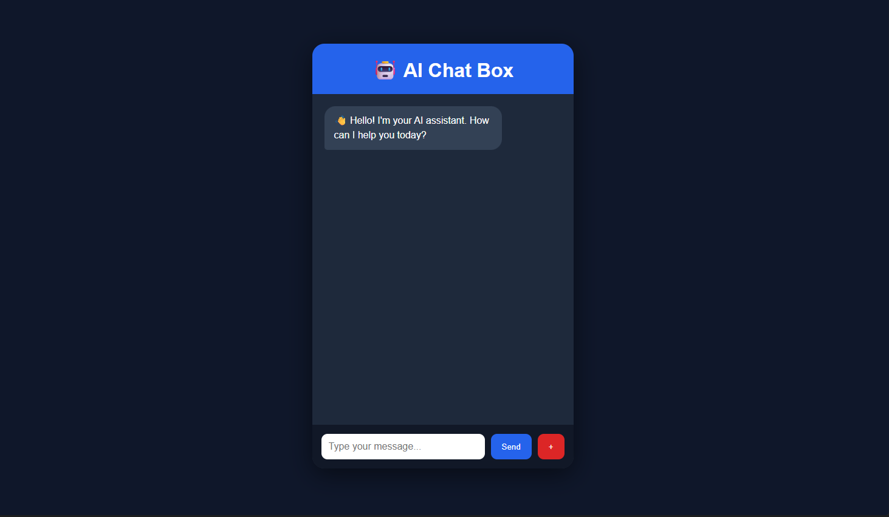

# 🤖 AI Chat Box

A modern AI-powered chatbot built with **Flask**, **JavaScript Fetch API**, and **Google Gemini API**. Users can chat with an AI assistant through a clean and responsive interface.

---

## ✨ Features

- 🤖 AI-powered conversations using Google Gemini
- 💬 Modern chat interface
- ⚡ Real-time communication using Fetch API
- ⌨️ Send messages without page reload
- 📝 Chat bubbles for user and AI
- ⏳ AI typing indicator
- 🗑️ New Chat button
- 🔒 API key secured using `.env`
- ⚠️ Error handling with retry mechanism
- 📱 Responsive design

---

## 🛠️ Tech Stack

- Python
- Flask
- HTML5
- CSS3
- JavaScript
- Fetch API
- Google Gemini API

---

## 📂 Project Structure

```
AI-ChatBox/
│
├── static/
│   ├── style.css
│   └── script.js
│
├── templates/
│   └── index.html
│
├── app.py
├── requirements.txt
├── .env
├── .gitignore
└── README.md
```

---

## 🚀 Installation

### Clone the repository

```bash
git clone https://github.com/yourusername/AI-ChatBox.git
```

### Navigate into the project

```bash
cd AI-ChatBox
```

### Install dependencies

```bash
pip install -r requirements.txt
```

### Create a `.env` file

```env
API_KEY=YOUR_GEMINI_API_KEY
```

### Run the project

```bash
python app.py
```

---

## 📸 Screenshots

### 🏠 Home Page



---

### 💬 AI Conversation


---

### 🤖 AI Typing Indicator


---

## 📚 What I Learned

- Flask routing
- API integration
- Fetch API
- Async JavaScript
- DOM manipulation
- Environment variables
- Exception handling
- Responsive UI development

---

## 📄 License

This project is open-source and available under the MIT License.
